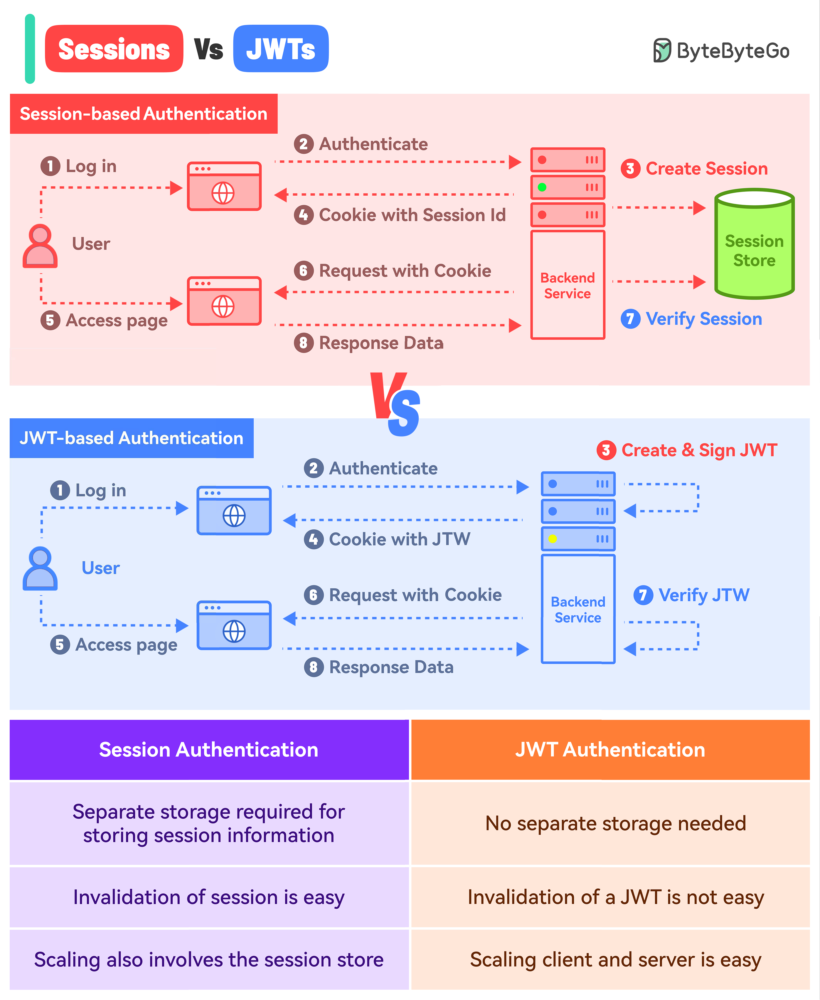

# Hybrid Authentication (JWT + Session/Database)

## 📌 What is Hybrid Authentication?

Hybrid authentication combines the **Stateless nature of JWTs** with the **Stateful control of Sessions/Database**.
It typically involves issuing two tokens:

1. **Access Token (JWT):** Short-lived (e.g., 15 minutes), stateless, and completely self-contained. Used to access protected APIs.
2. **Refresh Token:** Long-lived (e.g., 7-30 days), stateful (stored in the database), and used *only* to get a new Access Token when the old one expires.

## 🤔 Why is it Needed?

If you only use JWTs (stateless), you face a major security flaw: **You cannot instantly revoke a JWT.** If a hacker steals an active JWT, they have access until it expires.
If you only use Sessions (stateful), you face performance limitations: Every single API request requires a database lookup to verify the session.

**Hybrid Auth gives you the best of both worlds:**

- ✅ **High Performance:** 99% of requests use the fast, stateless JWT. No database lookup needed.
- ✅ **High Security & Revocability:** If a user is banned, logs out, or changes their password, you delete their Refresh Token from the DB. Within 15 minutes (when their short-lived JWT expires), they are completely locked out.

---

## 🗺️ Working Flow Mapping (Diagram)

---

## 💻 Practical Implementation Way

### 1. Database Schema Update

You need a table in your database to store valid Refresh Tokens.

```sql
CREATE TABLE refresh_tokens (
    id INT AUTO_INCREMENT PRIMARY KEY,
    user_id INT NOT NULL,
    token VARCHAR(255) NOT NULL UNIQUE,
    device_info VARCHAR(255),
    expires_at DATETIME NOT NULL,
    created_at TIMESTAMP DEFAULT CURRENT_TIMESTAMP,
    FOREIGN KEY (user_id) REFERENCES users(id) ON DELETE CASCADE
);
```

### 2. Backend Implementation (Express.js)

**A. Generate Tokens Function:**

```javascript
import jwt from "jsonwebtoken";
import crypto from "crypto";

export const generateTokens = async (userId, userEmail) => {
  // 1. Generate short-lived Access Token (Stateless)
  const accessToken = jwt.sign(
    { id: userId, email: userEmail },
    process.env.JWT_ACCESS_SECRET,
    { expiresIn: "15m" } // Very short lifespan
  );

  // 2. Generate long-lived Refresh Token (Stateful)
  // We can use a random string instead of a JWT for the refresh token
  const refreshToken = crypto.randomBytes(40).toString("hex");

  // 3. Save Refresh Token to Database
  const expiresAt = new Date(Date.now() + 30 * 24 * 60 * 60 * 1000); // 30 days
  await db.query(
    "INSERT INTO refresh_tokens (user_id, token, expires_at) VALUES (?, ?, ?)",
    [userId, refreshToken, expiresAt]
  );

  return { accessToken, refreshToken };
};
```

**B. Login Controller:**

```javascript
export const login = async (req, res) => {
  const { email, password } = req.body;
  
  // Verify User...
  const user = await verifyUserInDB(email, password);
  if (!user) return res.status(401).json({ message: "Invalid credentials" });

  const { accessToken, refreshToken } = await generateTokens(user.id, user.email);

  // Send both as HTTP-Only Cookies
  res.cookie("access_token", accessToken, {
    httpOnly: true, secure: process.env.NODE_ENV === "production", sameSite: "lax",
    maxAge: 15 * 60 * 1000 // 15 Min
  });

  res.cookie("refresh_token", refreshToken, {
    httpOnly: true, secure: process.env.NODE_ENV === "production", sameSite: "lax",
    path: "/auth/refresh", // ONLY sent to the refresh endpoint to save bandwidth
    maxAge: 30 * 24 * 60 * 60 * 1000 // 30 Days
  });

  res.status(200).json({ message: "Logged in" });
};
```

> **💡 Deep Dive: Cookie Security Properties**
> When setting modern authentication cookies, these specific property flags ensure maximum safety against different types of attacks:
> - **`httpOnly: true`:** Extremely critical! It prevents JavaScript running in the browser from accessing the cookie (e.g., `document.cookie`). Even if a hacker successfully injects malicious script into your website (XSS Attack), they **cannot** steal this token.
> - **`secure: process.env.NODE_ENV === "production"`:** When `true`, the browser will only send the cookie over encrypted **HTTPS** connections. In development (localhost), it falls back to `false` because local servers usually run over unencrypted HTTP.
> - **`sameSite: "lax"`** (or `"strict"`): This protects against **CSRF (Cross-Site Request Forgery)**. `"lax"` ensures the cookie is sent when navigating to your site from an external link, but prevents it from being sent in background API calls originating from a malicious third-party site.
> - **`maxAge`:** The exact lifespan of the cookie in milliseconds. Once this time expires, the browser automatically destroys it. (Example: `15 * 60 * 1000` = 15 minutes).
> - **`path: "/auth/refresh"`** *(used on the Refresh Token)*: A bandwidth and security optimization. It tells the browser, "Only attach this cookie when making a request specifically to the `/auth/refresh` endpoint." It prevents the browser from uselessly transmitting the bulky refresh token on every normal API request.


**C. The `/refresh` Endpoint:**

```javascript
export const refresh = async (req, res) => {
  const incomingRefreshToken = req.cookies.refresh_token;
  if (!incomingRefreshToken) return res.status(401).json({ message: "No refresh token" });

  // 1. Check if token exists in DB
  const [dbTokenRow] = await db.query(
    "SELECT * FROM refresh_tokens WHERE token = ? AND expires_at > NOW()",
    [incomingRefreshToken]
  );

  if (!dbTokenRow) {
    // SECURITY RISK: Invalid/Revoked token used!
    res.clearCookie("access_token");
    res.clearCookie("refresh_token");
    return res.status(403).json({ message: "Session expired or revoked. Please login." });
  }

  // 2. Token is valid. Issue a NEW Access Token.
  const user = await getUserById(dbTokenRow.user_id);
  const newAccessToken = jwt.sign(
    { id: user.id, email: user.email },
    process.env.JWT_ACCESS_SECRET,
    { expiresIn: "15m" }
  );

  // Optional: Rotate the refresh token too! (Security best practice)
  
  res.cookie("access_token", newAccessToken, {
    httpOnly: true, secure: process.env.NODE_ENV === "production", sameSite: "lax",
    maxAge: 15 * 60 * 1000
  });

  res.status(200).json({ message: "Token refreshed" });
};
```

### 3. Frontend Implementation (React/Axios)

The frontend needs an **Axios Interceptor**.
If any API request fails with a `401 Unauthorized` (meaning the Access Token expired), the interceptor automatically pauses the request, calls the `/refresh` endpoint, and then seamlessly retries the original request without the user ever knowing!

```javascript
import axios from "axios";

// Create an Axios instance
const api = axios.create({
  baseURL: "http://localhost:3000",
  withCredentials: true, // Always send cookies
});

// Response Interceptor setup
api.interceptors.response.use(
  (response) => {
    // If the request succeeds, just return the response
    return response;
  },
  async (error) => {
    const originalRequest = error.config;

    // IMPORTANT: Check if the error is 401 AND we haven't already retried this request
    if (error.response?.status === 401 && !originalRequest._retry) {
      originalRequest._retry = true; // Mark as retried to prevent infinite loops

      try {
        // Automatically attempt to refresh the token
        await axios.post("http://localhost:3000/auth/refresh", {}, {
          withCredentials: true 
        });

        // The refresh endpoint set a NEW access_token cookie.
        // We now retry the original failed API call!
        return api(originalRequest); 
        
      } catch (refreshError) {
        // If the refresh fails (refresh token expired or revoked in DB)
        console.error("Session completely expired. Must login again.");
        // Redirect user to /login page
        window.location.href = "/login";
        return Promise.reject(refreshError);
      }
    }

    // Return any other errors normally
    return Promise.reject(error);
  }
);

export default api;
```

With this Axios Interceptor, the Hybrid flow is completely invisible to the React components. You just use `api.get('/protected-route')` and it handles the token lifecycle automatically.
